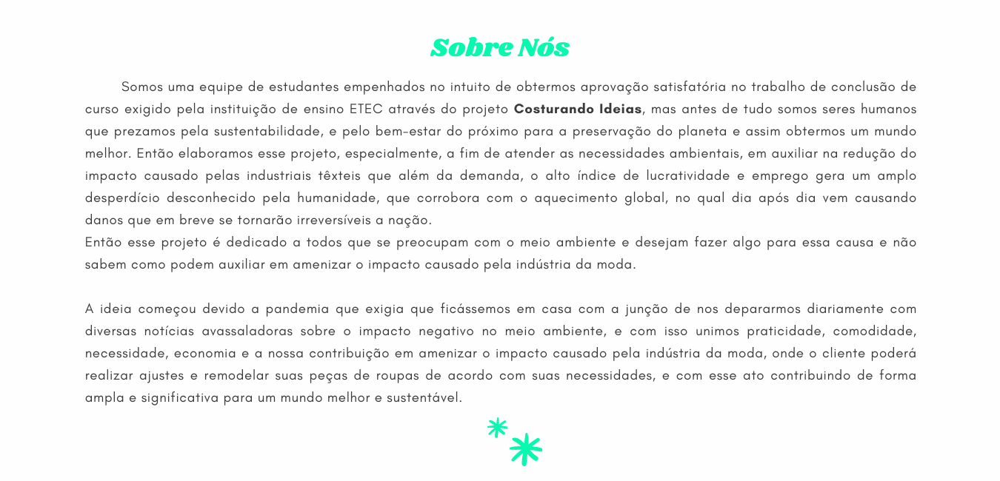
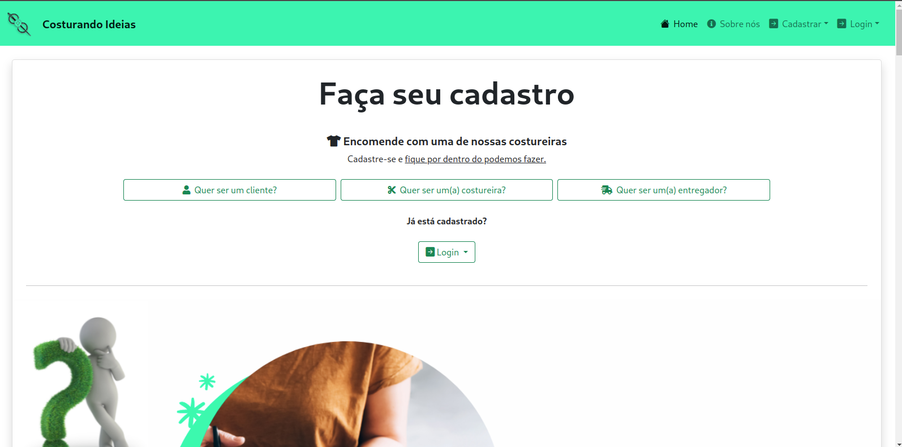
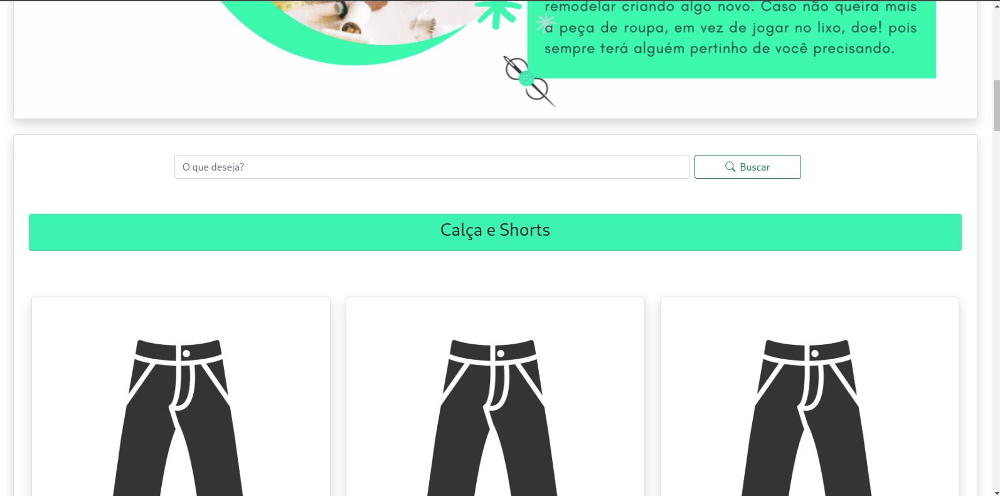
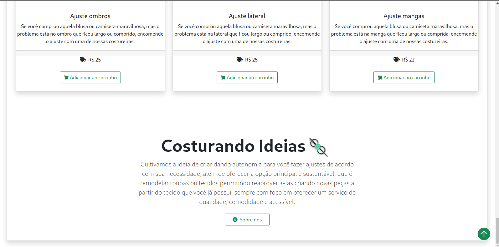
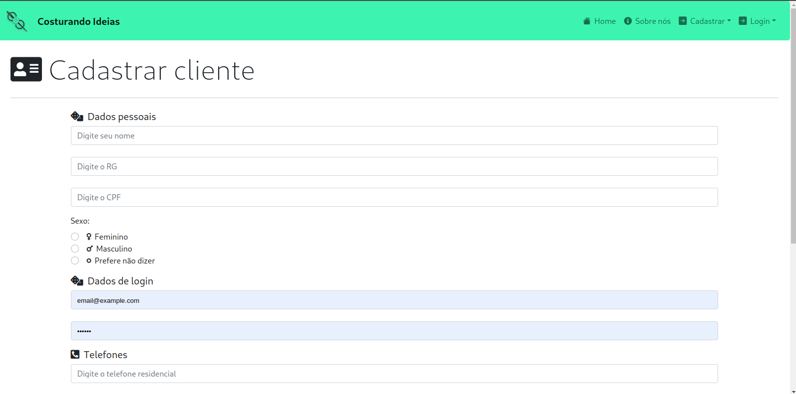
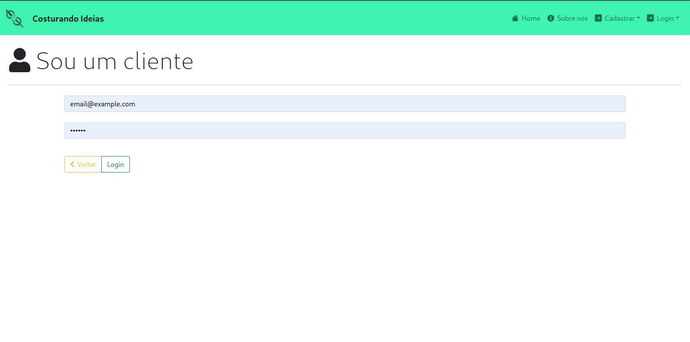

<!--  -->

 
    
    

        <h1>
            <b>Costurando Ideias</b>
        </h1>
        <h3>
            Criando e Remodelando Conceitos
        </h3>
    

## O que é o Costurando Ideias?

> ### O Costurando Ideias 
> é um **Trabalho de conclusão de curso** para a formação técnica no curso de **Desenvolvimento de Sistemas** da **ETEC-SP**. Se baseia na criação de um **web site** que interaja com os usuários para realizações de serviços de reparos e ajustes em roupas ou confecções e estilizações, sem que o usuário precise sair de casa para ir a um ateliê de costura, traz a **comodidade** e **praticidade** ao usuário. A empresa tem como visão atender uma grande região por meio deste web site, utilizando parcerias através de pequenos contratos com **costureiras** de diversas regiões. A interação com a costureira é bem simples ela se cadastra no web site especificando os tipos de serviços que realiza e compartilhando fotos dos seus trabalhos e confecções. A empresa por sua vez terá em seu banco de dados todos os tipos de serviços oferecidos pelas **costureiras** e fotos deles para expor no web site do cliente.

## Screenshots

